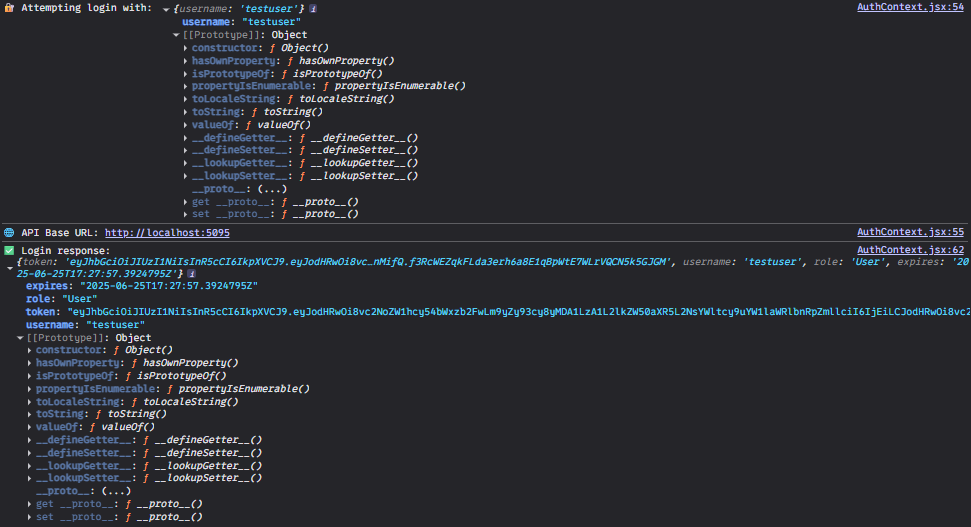
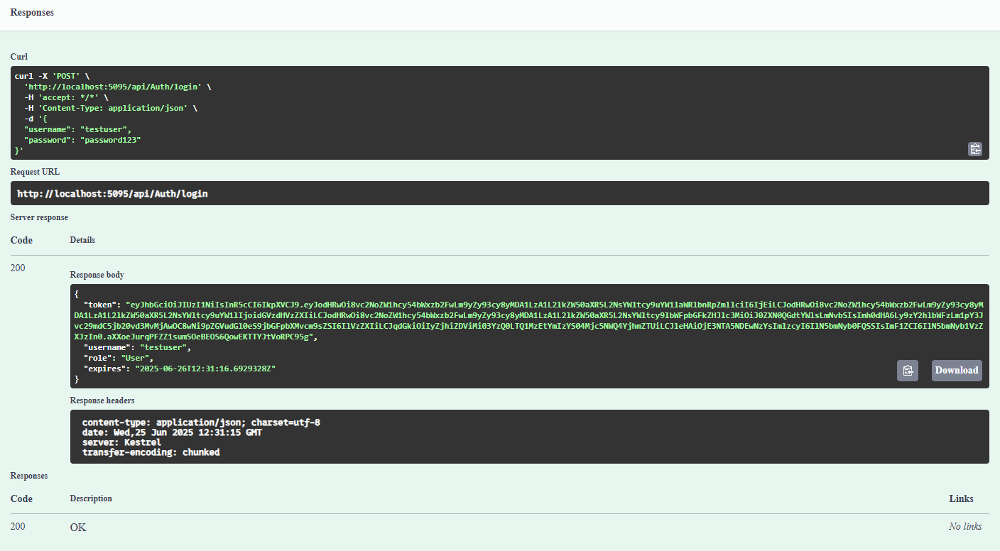

# Test Login
- linux
```
curl -X POST https://localhost:5095/api/auth/login \
  -H "Content-Type: application/json" \
  -d '{
    "username": "testuser",
    "password": "password123"
  }'
```
- windows
```
Invoke-RestMethod -Uri "https://localhost:5095/api/auth/login" `
  -Method POST `
  -ContentType "application/json" `
  -Body '{
    "username": "testuser",
    "password": "password123"
  }'
```
# Results:
1. MySQL Swagger: success
2. React: success
  - 
3. MsSQL Swagger: success
  - 